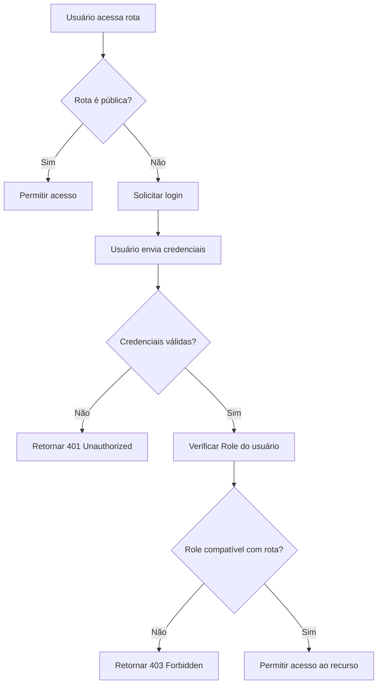

# 🔐 Spring Security Basic Demo

Este projeto demonstra **autenticação e autorização** usando **Spring Security** com autenticação in-memory e controle de acesso por roles (`ADMIN` e `USER`).

## 📌 Funcionalidades

- Autenticação usando usuários armazenados **in-memory**
- Criptografia de senha com **BCrypt**
- Controle de acesso baseado em **roles**
- Endpoints públicos e protegidos
- Configuração via **HttpSecurity**

---

## 📂 Estrutura de Pastas

```text
spring-security-basic-demo/
├── build.gradle.kts
├── src
│ ├── main
│ │ ├── java
│ │ │ └── com
│ │ │ └── example
│ │ │ └── securitybasic
│ │ │ ├── SecurityBasicApplication.java
│ │ │ ├── config
│ │ │ │ └── SecurityConfig.java
│ │ │ └── controller
│ │ │ └── DemoController.java
│ │ └── resources
│ │ └── application.properties
│ └── test
│ └── java
│ └── com
│ └── example
│ └── securitybasic
│ └── SecurityBasicApplicationTests.java
```

---

## 🚀 Endpoints

| Método | Endpoint  | Descrição | Role Necessária |
|--------|----------|-----------|-----------------|
| GET    | `/public` | Endpoint público, sem autenticação | Nenhuma |
| GET    | `/user`   | Endpoint protegido para usuário comum | USER ou ADMIN |
| GET    | `/admin`  | Endpoint protegido para administrador | ADMIN |

---

## 👤 Usuários de Teste

| Usuário | Senha     | Role  |
|---------|----------|-------|
| admin   | admin123 | ADMIN |
| user    | user123  | USER  |

---
## 🔄 Fluxo de Autenticação e Autorização




